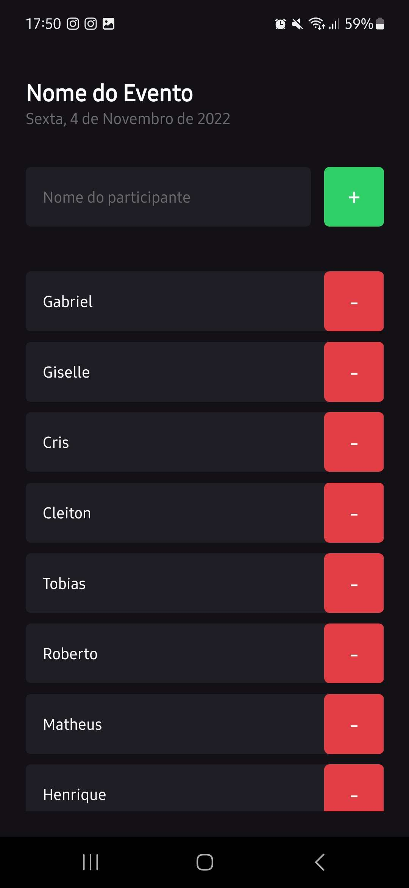

<div align="center">
  
  
</div>

## 👨🏽‍💻 Stack

- [x] ReactNative
- [x] Typescript

## Executando o projeto

Faça o clone deste projeto em seu computador e depois execute com npm:

para rodar o frontend
```bash 
cd im-here
npx expo start
```

